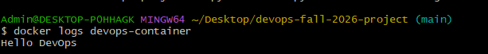
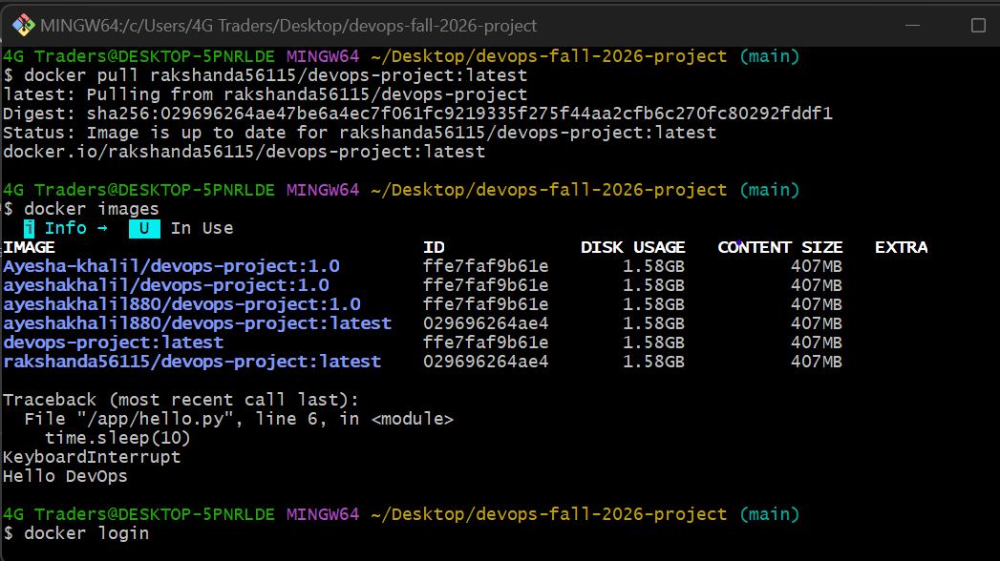
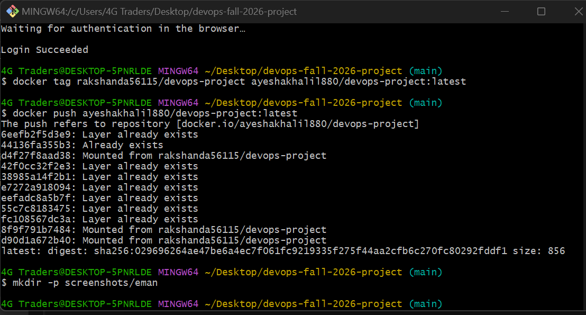
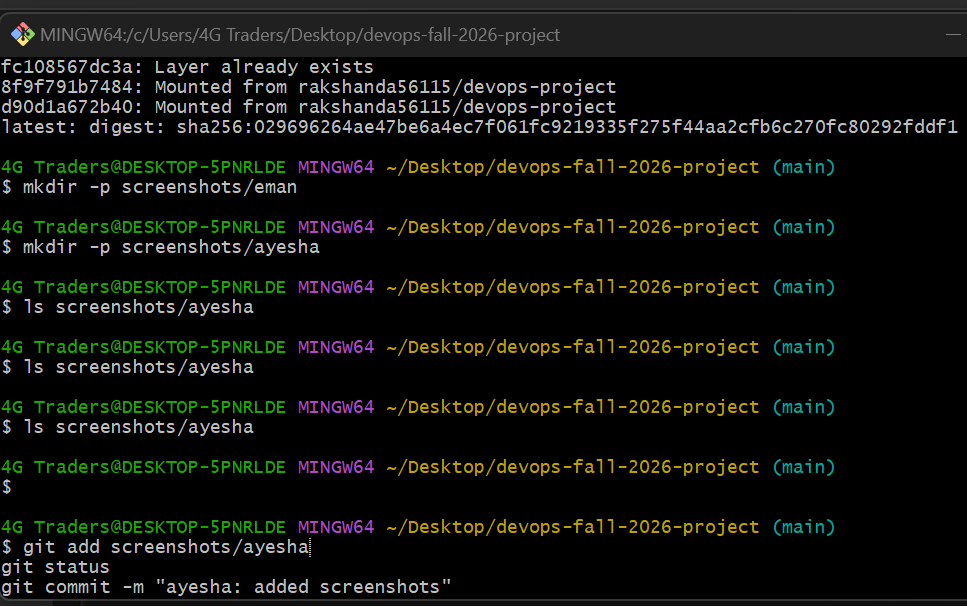

DevOps Fall 2026 Project

A simple Hello DevOps Python application containerized using Docker as part of the DevOps course project.

Group Members
Name	ID	Section
Rakshanda Mehboob	56115	BSSE 6
Ayesha Khalil	55693	BSSE 6
Eman Idress	56964	BSSE 6
Aqsa Ahmed	53106	BSSE 6
Esha Eman	57381	BSSE 6
Project Files
hello.py – Python application
Dockerfile – Docker configuration
README.md – Project documentation
Build the Docker Image
docker build -t devops-project .
Run the Docker Container
docker run -d --name devops-container devops-project
Check Running Container
docker ps
View Output
docker logs devops-container

Expected Output

Hello DevOps


 Aqsa Ahmed - Docker Pull Test

Pulled the latest Dockerfile from the repository and pulled the group's Docker image from Docker Hub, then tested that the container runs correctly.

Commands used
docker pull rakshanda56115/devops-project:latest
docker images
docker run --name aqsa-test rakshanda56115/devops-project:latest
docker ps -a
docker rm aqsa-test

Screenshots




Esha's Work – Docker

 Pulled the project Docker image from Docker Hub.
 Verified the image using `docker images`.
 Ran the Docker container and tested the application output.
 Tagged the project image with my Docker Hub repository name.
 Pushed the tagged Docker image to Docker Hub successfully.

 Commands Used

```bash
docker pull rakshanda56115/devops-project:latest
docker images
docker run --name esha-test rakshanda56115/devops-project:latest
docker tag rakshanda56115/devops-project 57381/devops-project
docker push 57381/devops-project
```

The Docker image was successfully pushed to Docker Hub with the tag `latest`.

Eman Idrees 
docker pull rakshanda56115/devops-project:latest
docker images
docker run --name eman-test rakshanda56115/devops-project:latest
docker ps -a
docker rm eman-test
https://hub.docker.com/repository/docker/emanidrees/devops-project/general

## Ayesha Khalil – Docker

Pulled the project Docker image from Docker Hub.
Verified the Docker image using `docker images`.
Ran the Docker container and checked that the application runs successfully.
Tested the container and verified the expected **Hello DevOps** output.

### Commands Used

```bash
docker pull rakshanda56115/devops-project:latest
docker images
docker run --name ayesha-test rakshanda56115/devops-project:latest
docker ps -a
docker rm ayesha-test
```

### Screenshots







