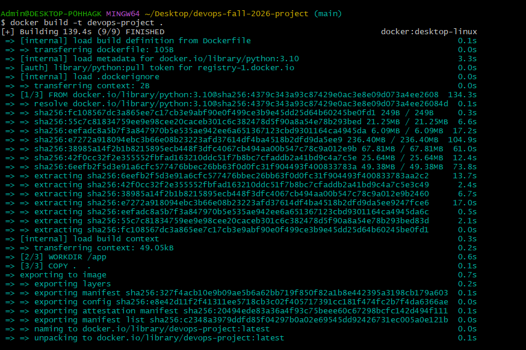

# Docker Steps (Aqsa Ahmed)

## Build the Docker image
docker build -t devops-project .

## Run the container
docker run -d --name devops-container devops-project

## Check the container
docker ps -a

## View the app output
docker logs devops-container

## Screenshots

